# Internship Documented
Report of my work at intellify,
Responsibilities as a backend developer were following: 
Designing models with best practices, maintaining database and Write clean and maintainable code for other developers.

# Technical Features:

1. Uses REST API architectural style for designing networked application.

2. Procedural approach using Pythons Django-REST framework.

3. Clean MVC pattern with ORM.

4. Features like OTP based login system, JWT Auth, sessions, google recaptcha and Push-Notifications for android app users.

5. Different 3rd party python modules and packages for easy functionality of certain features.

6. Clean and reusable API doc for better understanding and testing for android Developers.

7. Uses AWS (EC2), database (RDS), and static files storage (S3).

8. Default testing code is deployed on Heroku with Postgres db to store user data and uses Django-Staticfiles to store static data.

9. App consisted different microservices each with scalable database deployed independently.

10. Each app serves different purpose ranging from user auth, to online classrooms to quiz creation to live attendance mechanism.

# Screenshots
<h1>Home </h1>

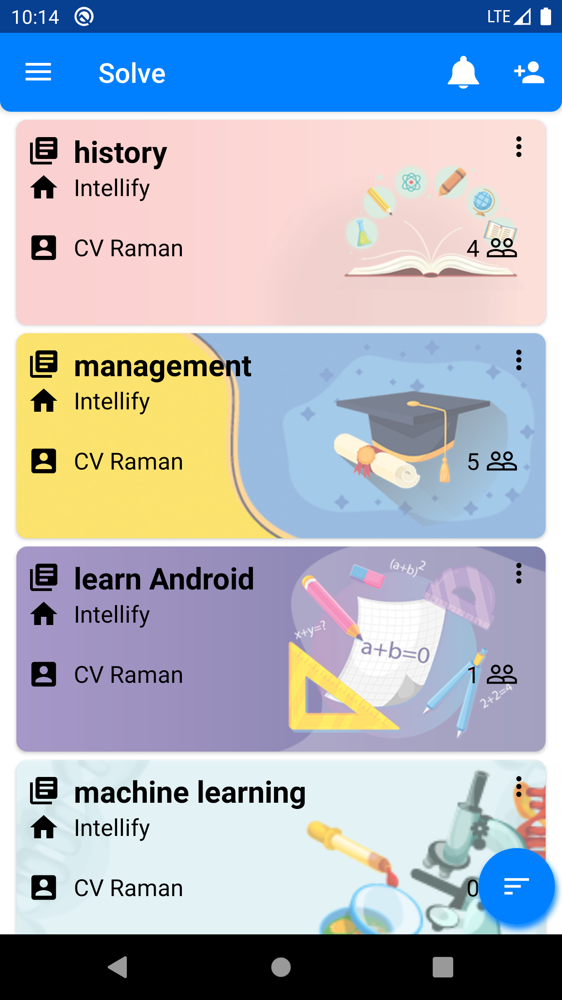
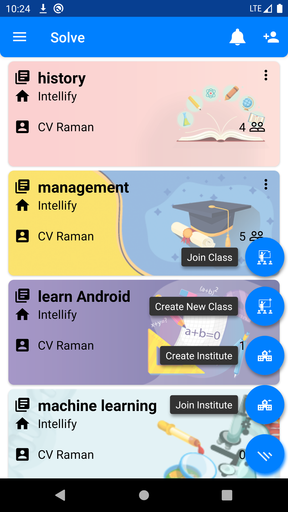

<h1>Navbar and Study Material </h1>

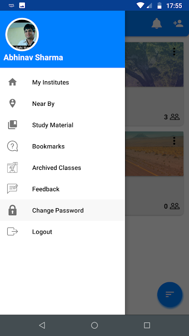
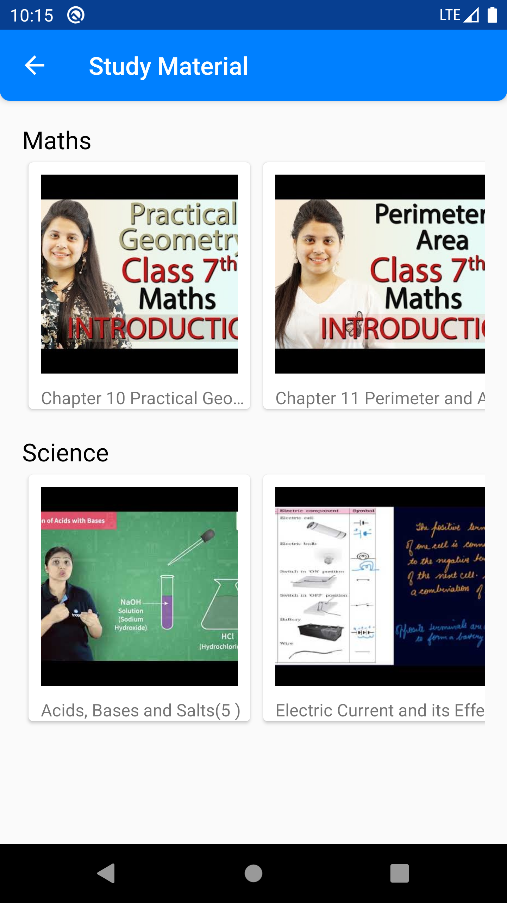

 
<h1>View Lectures and See Members</h1>

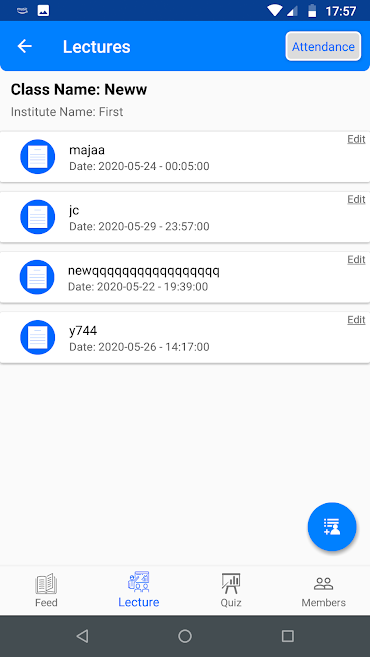
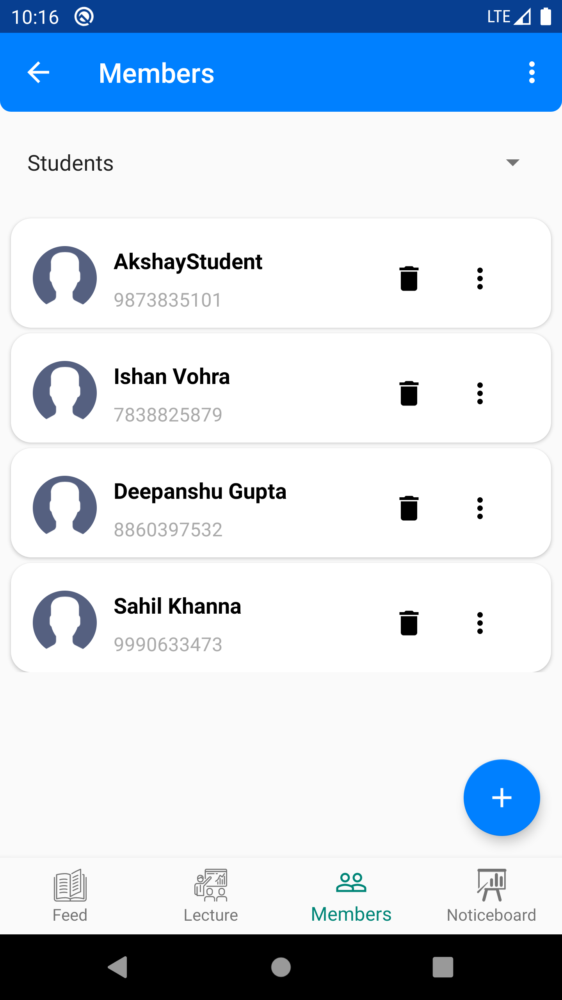

 
<h1>Create Noticeboard and Lecture Details</h1>

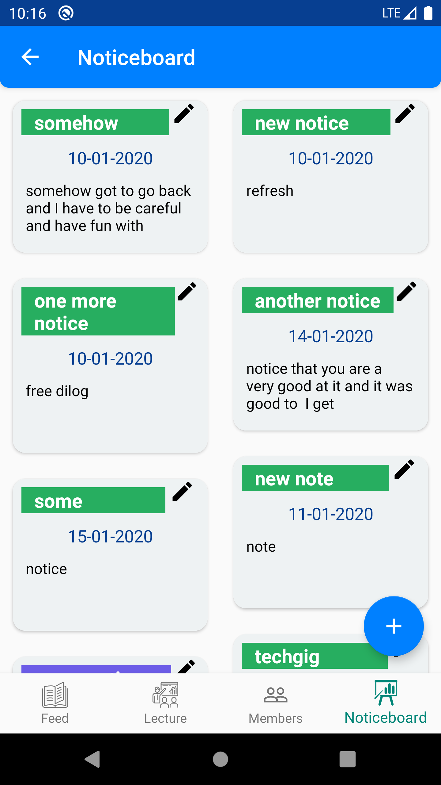
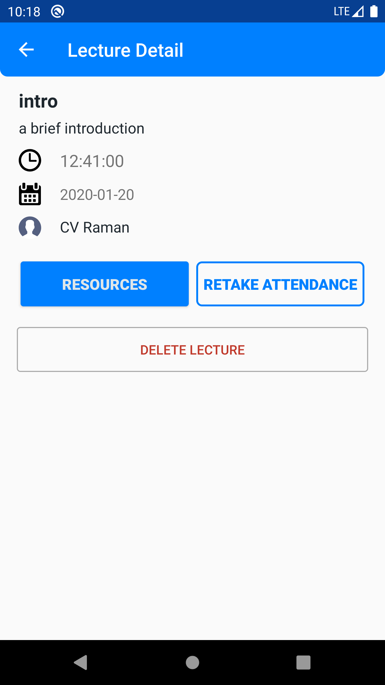

 
<h1>Take attendance and Upload Resource</h1>

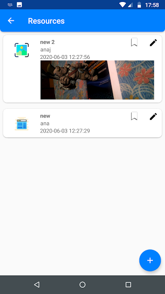

 
<h1>View Resource and Comment on Resources</h1>

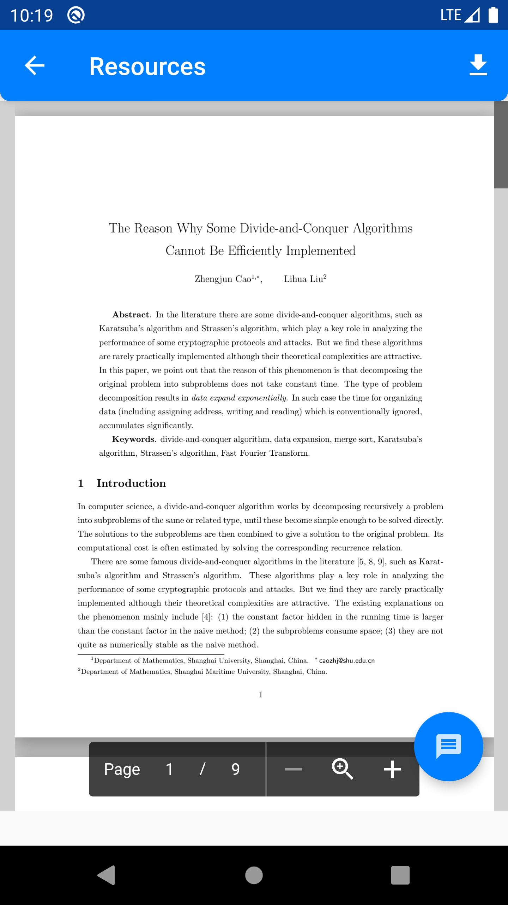
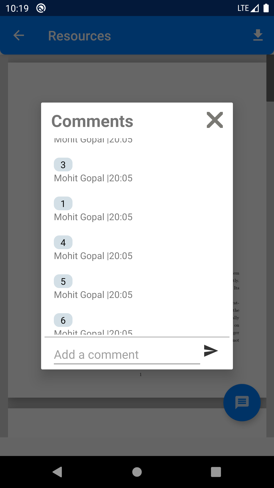

 

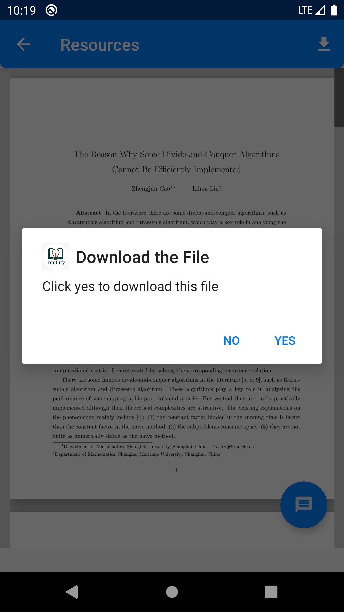
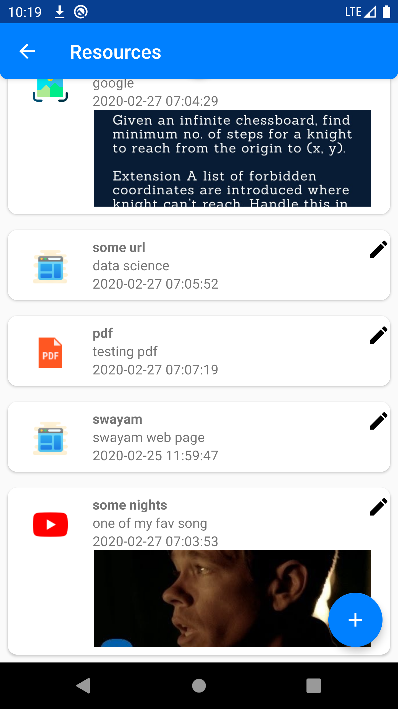

 

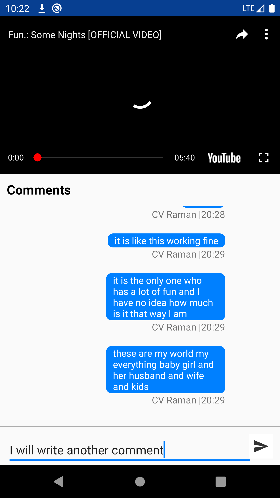
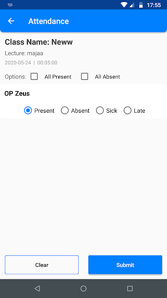

 

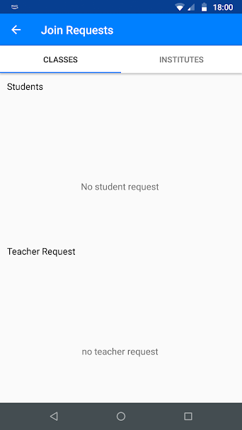

## Credits
Intellify team

